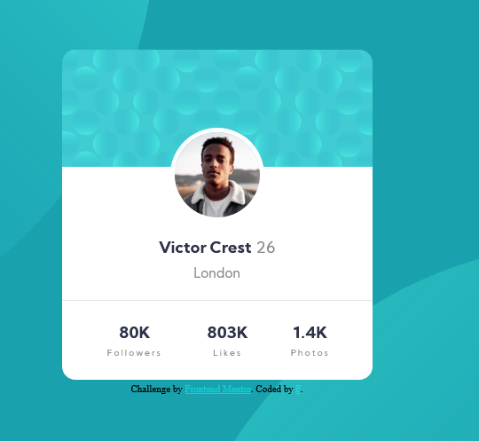

# Frontend Mentor - Profile card component

### Screenshot

### Links

- Live Site URL: [Add live site URL here](https://your-live-site-url.com)

## My process

### Built with

- Semantic HTML5 markup
- CSS custom properties
- Flexbox
- Mobile-first workflow

### What I learned

    This is the third challenge I take from frontendmentor.io.
    _Gain more knownledge of design from top to bottom.
    _Centering picture, z-index, css variables.
    _Responsive design and a bit of background positioning.
    _I may change background positioning to image and use transform to keep the circle on the back much easier to control.
